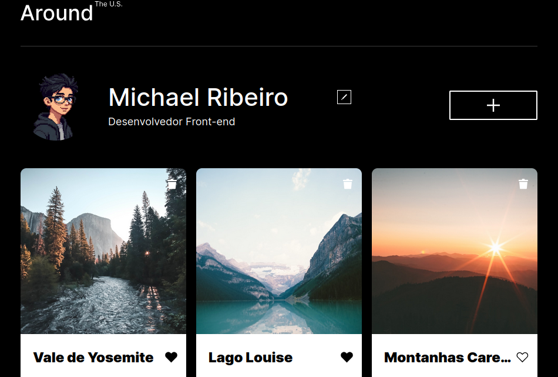

<h1 align="center">📸 Around The U.S.</h1>
<p align="center">
  Galeria fotográfica interativa para compartilhar, curtir e gerenciar lugares favoritos, com dados persistidos via API REST.

<p align="center">
  <a href="(DEPLOY_LINK)" target="_blank">
    
  </a>
</p>

## 🎬 Demonstração

<a href="https://youtu.be/G5R94ymmBZs" target="_blank">
  
</a>

> ▶️ Clique na imagem acima para assistir ao vídeo completo no YouTube.

## 🖼️ Screenshot



## 🛠️ Tecnologias

<p align="left">
  
  
  
  
  
  
  
  
  
</p>

## ✨ Funcionalidades

- 🖼️ Criação e exclusão de cartões (com confirmação)
- ❤️ Curtir / descurtir imagens
- 👤 Edição de perfil (nome, descrição e avatar)
- 🔍 Visualização ampliada de imagens
- ✅ Validação de formulários em tempo real
- ⌨️ Fechamento de popups via overlay ou tecla `ESC`
- 💾 Persistência de dados via API REST
- 📱 Layout 100% responsivo
- ⚛️ Componentização total com React

## 🚀 Como executar

```bash
# Clone o repositório
git clone https://github.com/michael-ribeiro-fs/web_project_around_react

# Acesse a pasta do projeto
cd web_project_around_react

# Instale as dependências
npm install

# Inicie o servidor de desenvolvimento
npm run dev
```

## 🗺️ Roadmap

- [x] CRUD de cartões via API
- [x] Edição de perfil e avatar
- [x] Validação de formulários
- [x] Migração completa para React (Vite, componentes funcionais, hooks)
- [x] Popups controlados por estado
- [x] Efeitos colaterais com `useEffect` para integração com API
- [ ] Autenticação (login/registro) (em planejamento)
- [ ] Suporte a múltiplos usuários (em planejamento)
- [ ] Testes automatizados
- [ ] Melhorias de acessibilidade
- [ ] Deploy em produção

## 📝 Licença

Software Próprio

## 👤 Autor

**Michael Ribeiro**
Projeto desenvolvido durante o programa de Desenvolvimento Web da **TripleTen**.
